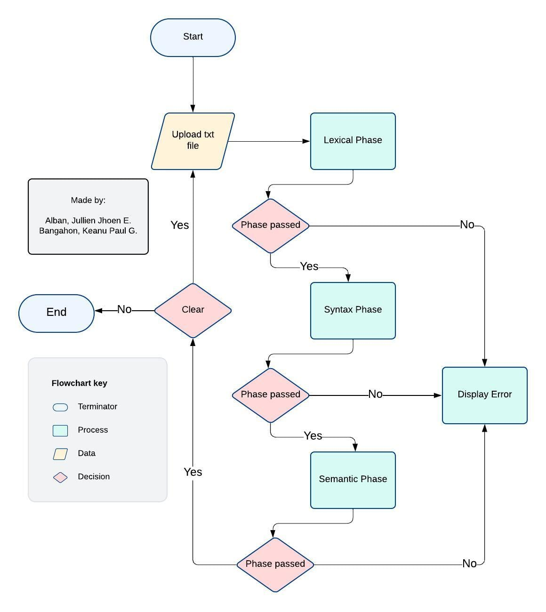
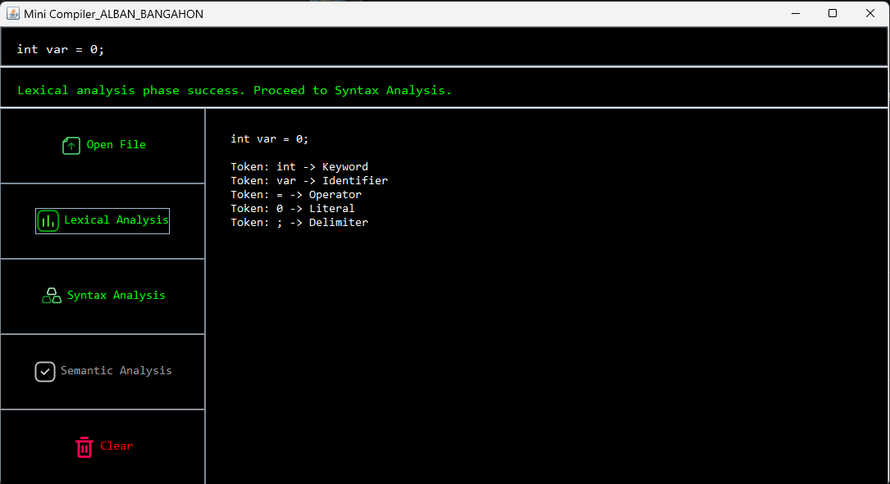

# Mini Compiler (Variable Declaration)

**A simple java program that demonstrates the compiler process, lexical, syntax, and semantic. This program only accepts variable declaration in java.**  

    Note: This project a requirement for our Final Term 
    in the course Theory of Programming Languages,
    1st Sem AY 2024-2025.
    - J.ALBAN & K.BANGAHON

 

## This Source Code Contains
📁 `public/` - contians imgs, svgs, etc. 
📁 `testfiles/` - contains 4 text files for testing  
 `Lexical Analyzer.java` - java class for lexical phase of compiler  
 `Syntax Analyzer.java` - java class for syntax phase of compiler   
 `Semantic Analyzer.java` - java class for semantic phase of compiler   
 `Main.java`  - java class that contains the main method  

 

## Flowchart
This shows the phases of the compiler and logic for the program. 

  

 

## The UI
The simple Java GUI contains 3 panels, the result panel at the top, the buttons at the left, and the output panel on the right.
   
  

 `Open File` - opens a file limited to .txt only.  
 `Lexical Analysis` - Starts the Lexical analysis phase to tokenize each term in the input file. Can only start once file is uploaded.  
 `Syntax Analysis` - Starts the Syntax Phase where tokens are parsed and are analyzed based on grammar. Can only start once Lexical is accepted.  
`Semantic Analysis` - Starts Semantic Phase for type checking, see if the data type matches the value of the variable. Can only start once Syntax is accepted.  
`Clear` - Clears everything and starts over to Open File
   

 ## Test Cases
`📁 testfiles/` contains 3 test cases.   
&nbsp;&nbsp;&nbsp;&nbsp;&nbsp;&nbsp;
 [1] *int var = 0;*   &nbsp;&nbsp;&nbsp;&nbsp;&nbsp;&nbsp;**Accepted**. Proper variable declaration
  
&nbsp;&nbsp;&nbsp;&nbsp;&nbsp;&nbsp; 

 [2] *int v@r = 55;*   &nbsp;&nbsp;&nbsp;&nbsp;&nbsp;&nbsp;**Failed in Lexical.** Token ' v@r ' is an inappropriate variable name
  
&nbsp;&nbsp;&nbsp;&nbsp;&nbsp;&nbsp;

[3] **String var = "hello"**   &nbsp;&nbsp;&nbsp;&nbsp;&nbsp;&nbsp;**Failed in Syntax.** Missing delimeter ' ; '
  
&nbsp;&nbsp;&nbsp;&nbsp;&nbsp;&nbsp;

[4] **boolean var = "maybe";**   &nbsp;&nbsp;&nbsp;&nbsp;&nbsp;&nbsp;**Failed in Semantic.** Value does not match data type.
  

   

    Instructor: Prof. Irysh Paulo R. Tipay
    Students: Jhoen Alban & Keanu Bangahon
    Theory of Programming Languages Final Term 2024-2025
